 

&nbsp;
&nbsp;

---

## 👩‍💻 About Me

Undergrad student who spend my time between cybersecurity labs, CTF challenges, web dev experiments, and the occasional rabbit hole that starts with "just one more room" on TryHackMe. I've published a research paper, won a national hackathon, and I'm just getting started.

> *Currently figuring out the internet — one packet at a time.* 🔍

---

## 🚀 Currently

- 🔐 Grinding TryHackMe rooms & CTF challenges
- 🌐 Building web projects & sharpening frontend skills
- 📖 Deepening knowledge in threat detection & SIEM
- 🧠 Learning · Breaking · Building · Repeating

---

## 🏅 TryHackMe

&nbsp;&nbsp;🌐 Networking Nerd &nbsp;·&nbsp; 🕸️ Webbed &nbsp;·&nbsp; 🌍 World Wide Web &nbsp;·&nbsp; 🐱 cat linux.txt &nbsp;·&nbsp; 🔥 3 Day Streak &nbsp;·&nbsp; ⚡ 7 Day Streak

---

## 🏆 Highlights

📜 &nbsp;**Pre-Security Learning Path** — TryHackMe

📜 &nbsp;**Introduction to Cybersecurity** — Cisco Networking Academy

🥈 &nbsp;**2nd Prize** at a National Level Hackathon

🚩 &nbsp;**6+ CTFs** competed across multiple platforms

📄 &nbsp;**Published Research** — *"An Integrated SIEM Approach for Real-Time Threat Detection and Log Analytics in Higher Education ERM Systems"*

---

## 🛠️ Skills & Stack

**Languages**

&nbsp;
&nbsp;
&nbsp;
&nbsp;

**Security**

&nbsp;
&nbsp;
&nbsp;
&nbsp;

**Tools**

&nbsp;
&nbsp;

---

## 🔗 Let's Connect

&nbsp;

---

*"The quieter you become, the more you are able to hear."* — Kali Linux

